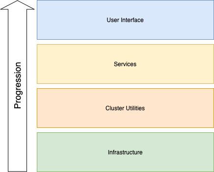

deployments
===========

This repository contains Terraform projects that manage three different types of cloud-based deployments:
* prod
* stage
* developer

Each deployment type has slightly different characteristics, summarized in the table below:
| Deployment Type | Persistent | Instances | Usage                                                        |
| --------------- |:----------:| --------- | ------------------------------------------------------------ |
| prod            | yes        | 1         | Production deployment                                        |
| stage           | no         | 1         | Deployment used to verify deployment prior to updating prod. |
| developer       | no         | multiple  | Personal deployments used to develop changes.                |

## Deployments

### Prod
This is the production deployment.  Maintaining availability of this deployment is critical.  All changes brought to this deployment have been verified in the stage deployment beforehand.  The state of this deployment is tracked by Terraform Cloud.  Deployments are handled by automation linked to GitHub repository events.

### Stage
This is a special deployment used solely for the purpose of verifying changes that will be made to production can be done safely.  The **stage** deployment is not persistent.  Instead, when a change or set of changes is ready to be tested the stage deployment is created using the latest configuration from the *main* branch, then the proposed changes are applied to the **stage** deployment.  Once applied, the verification tests are executed, and finally the deployment is destroyed.  The state of this deployment is tracked by Terraform Cloud, despite the fact that most of the time the deployment is completely destroyed.  Deployments are handled by automation linked to GitHub repository events.

### Developer
The developer deployment is a generic project that allows for multiple instances to co-exists, in order to avoid conflicts if more than one change needs to be developped at the same time.  The state of these deployments are *not remotely tracked*.  Deployments are run manually from workstations.

## Deployment Architecture

Deployments consist of a collection of components, as shown in the diagram below:


In the Terraform project, each component is represented by a Terraform module.  These module simply include other modules that are maintained in separate source code repositories.  This two-tier approach allows the higher level tier of modules to be used for targetting during applies.  For instance, a Terraform **apply** command can target the **infrastructure** module.  At the same time, each of the lower tier modules can be developed, verified, and released independently.

### Infrastructure
The Infrastructure component consists of networking, kubernetes cluster, and various compute instances needed to support the stack.  Currently, all of the resources for this component are manged by a single Terraform module.

### Cluster Utilities
The Cluster Utilities component consists sub-components that require the Infrastructure component to be in place, and in turn must be in place in order for the Service component to be deployed.  Each independent sub-component is captured by a child Terraform module.

### Services
The Services component consists of all of the backend services.  Much like the Cluster Utilities component, each backend service is captured by a child Terraform module.

### User Interface
The User Interface component consists of static assets that can either be deployed to a Content Delivery Network (CDN) or deployed into the Kubernetes cluster just like the backend services, depending on the type of deployment.  The **prod** and **stage** deployments utilize the CDN to provide the best user experience possible, whereas developer deployments simply deploy the component in the Kubernetes cluster in order to minimize costs.

## Deployment Process
The primary goal of the deployment process is to minimize the divergence between deployment types, while realizing that there are fundamental configuration differences between the deployment types.  The process achieves this by maintaining  separate Terraform project for **developer** deployments and a shared Terraform project for the **prod** and **stage** deployments.  The process is described below for each of the deployment types in the natural order that they are applied.

### Developer Deployment Process
Developer deployments are used while developing changes to one or more of the lower level components: Infrastructure or Cluster Utilities.  A typical development cycle involving a **developer** deployment consists of modifying the source code of one or more child modules of the targeted component on a local workstation.  The corresponding module block from the appropriate component modules (`./modules/` from this repository) is then modified (**source** attribute) to refer to the local child module code, rather than the `git@github.com` location.  The altered local configuration can now be applied with the standard deploy script to create a new or update an existing **developer** deployment.  Once the deployment is no longer needed, the deploy script is used to destroy the **developer** deployment.

### Stage Deployment Process
A formal rule for the **stage** and **prod** deployments is that only `git@github.com` locations are used in the **source** attribute of the module blocks.

Consequently, prior to proceeding with the **stage** deployment process, all changes made to child modules must be committed to their respective repositories, merged to the *main* branch, and a new release of the module must be created.

Next, a temporary branch is created from the HEAD revision of the *main* branch of this repository.  On this branch, modifications are made to the **source** attribute of the appropriate modules.  Since, only released versions of the modules are allowed, this generally means that the change consists of changing the tag reference in the location.

For example, changing:
```hcl
module "gke-cluster" {
    source = "git@github.com:marcboudreau/accentis-gke-cluster-module?ref=v0.1.0"

    # ....
}
```

to:
```hcl
module "gke-cluster" {
    source = "git@github.com:marcboudreau/accentis-gke-cluster-module?ref=v0.1.1"

    # ....
}
```

Once a Pull Request for this branch is created, the deploy script will automatically be invoked to first deploy the **stage** deployment using the configuration from the *main* branch, to establish an existing environment that mimicks the **prod** deployment as closely as possible.  Then, the deploy script will then be invoked using the code from the current branch, resulting in an update to the **stage** deployment.  Next, the automated verification test suites will be executed to validate the final state of the **stage** deployment.  Finally, the deploy script will be used to destroy the **stage** deployment.  If any of these steps fail, the required status check for the Pull Request will be marked as failed, which will prevent the Pull Request from being merged.  At this point, the Pull Request will either be abandonned (closed) or a follow-up commit to address the issue that caused the failure will be pushed, which will re-trigger the automation to run.

A manual review of the Pull Request must also be completed in order to allow the Pull Request to be merged.  During this review, the results from the automated testing are examined.  The Terraform plan is also vetted to make sure that all actions taken by Terraform are appropriate for the **prod** deployment.  For example, a plan that has Terraform destroying and recreating the entire VPC network might not be acceptable due to the disruption that it would cause.

Once all required checks for the Pull Request have been met, including a manual review, the Pull Request can be merged into the *main* branch, which is the point where the **prod** deployment process begins.

### Prod Deployment Process
The deployment process for the **prod** deployment is merely a continuation of the **stage** deployment process.  It begins at the end of the **stage** deployment process when the Pull Request is merged.  That merger causes the deploy script to be invoked, but because the branch is the *main* branch, the **prod** deployment is updated instead of the **stage** deployment.  The **prod** deployment has a set of verification tests that continually run to discover issues in the **prod** deployment, as such, there's no need to include running the verification tests as part of the deployment process.

## Scripts
This repository has two scripts that are routinely used by developers or the automation:

1. **deploy.sh** - The primary script that provides the logic to affect a deployment
1. **developer.sh** - A wrapper script around **deploy.sh** to be used by developers to affect their developer deployment

### deploy.sh
This script is used directly by automated processes and indirectly by developers via the **developer.sh** script.  All inputs to this script must be provided via environment variables, with the exception of the Terraform command which can be passed in as the sole command line argument. If no Terraform command is specified as a command line argument, the **apply** command is assumed.

### developer.sh
This script is intended to be used by developers in an interactive setting.  The script is designed to gather all necessary inputs from environment variables if they are set, otherwise the script prompts the operator for values.  It also accepts a single command line argument: the terraform command.  If the command line argument is omitted, the apply command is assumed.

Once all inputs have been gathered, this script must configure the shell environment so that any environment variable needed by the **deploy.sh** script are in place.
